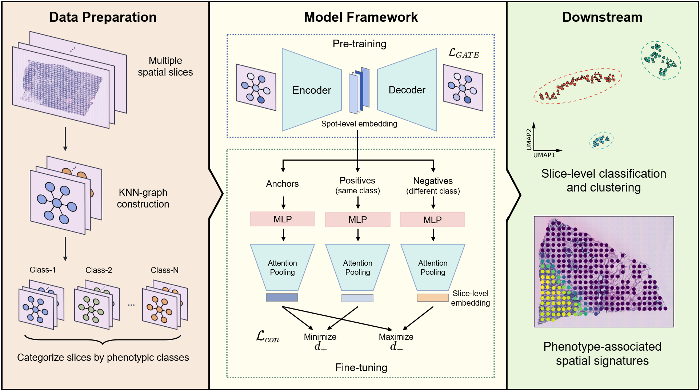

[](https://github.com/gao-lab/PASSAGE/stargazers)
[]({[linkUrl](https://www.python.org/downloads/release/python-31013/)})
[](https://opensource.org/licenses/MIT)


# PASSAGE
Learning phenotype associated signature in spatial transcriptomics with PASSAGE



## Environment
```
mamba env create -f passage_environment.yaml
mamba activate passage
```

## Installation
```
git clone https://github.com/gao-lab/PASSAGE
cd PASSAGE
python setup.py build
python setup.py install
```
## Tutorial
For usage, please see the jupyter-notebook example [here](./tutorial/tutorial.ipynb).


## Citations
Guo, C.-K., Xia, C.-R., Peng, G., Cao, Z.-J. & Gao, G. Learning phenotype associated signature in spatial transcriptomics with PASSAGE. bioRxiv 2024.09.06.611564 (2024) doi:10.1101/2024.09.06.611564.

